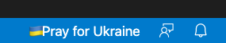
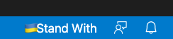
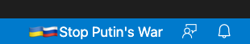

# Pray for Ukraine

Display a message in the status bar to express your support for the people in Ukraine.

## Features

- Default message



- You can display any message you want.





- No other functions whatsoever.

## Extension Settings

This extension contributes the following settings:

* `pray4ukraine.message`: set a message to display in the status bar
    - Default: "Pray for Ukraine"

example:

```
{
    pray4ukraine.message: 'Stand With'
}
```
